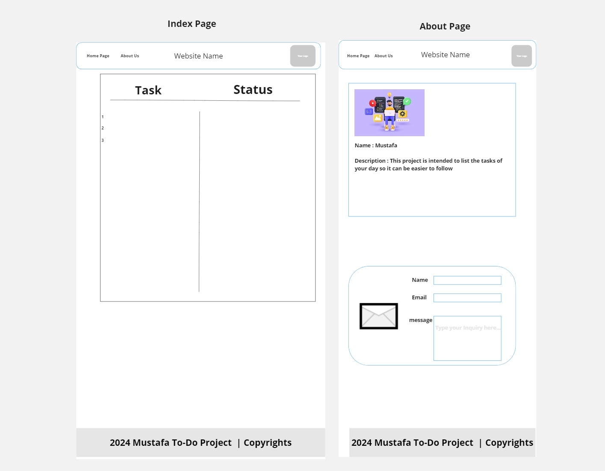

# todo-project

## Lab 5 
a new js code has been added to the project to make it more interactive which introduced 
** Popup boxes 
** Declaration
** if statement 
## Lab 6 
update has been uploaded to the same js code so it can include and introduce new topics : 
** Loops (for,while)
** Declaration Scopes 
** Functions 
** Arrays